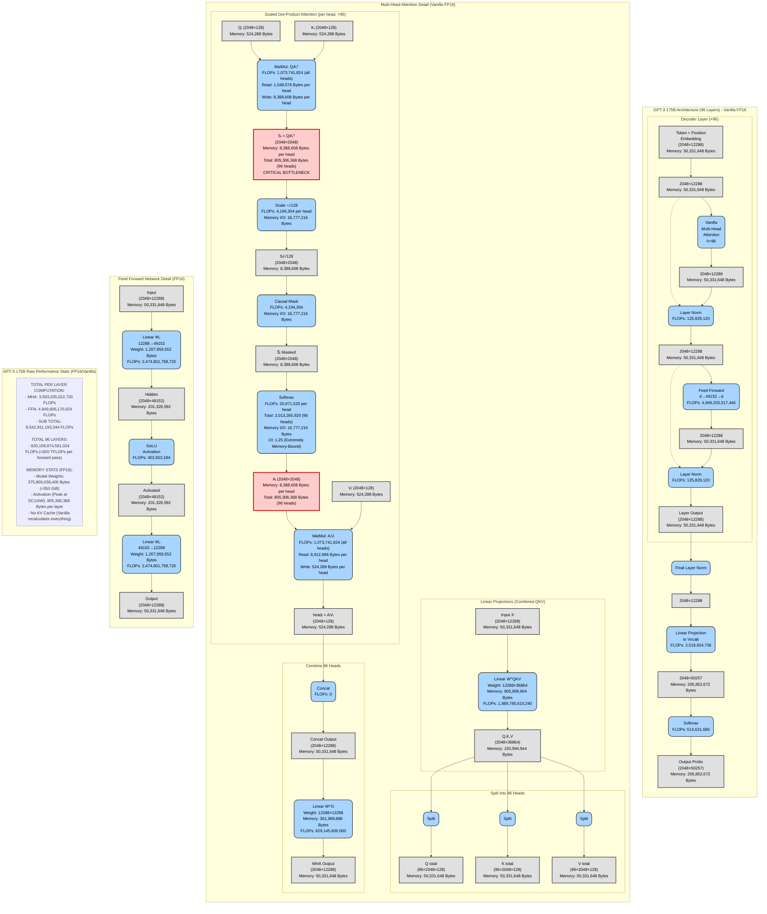

```mermaid

graph TB
    subgraph MainArch["GPT-3 175B Architecture (96 Layers) - Vanilla FP16"]
        direction TB
        subgraph DecoderLayer["Decoder Layer (×96)"]
            direction LR
            IE["Token + Position<br/>Embedding<br/>(2048×12288)<br/>Memory: 50,331,648 Bytes"] --> D1["2048×12288<br/>Memory: 50,331,648 Bytes"]
            
            D1 --> MMHA("Vanilla<br/>Multi-Head<br/>Attention<br/>h=96")
            MMHA --> DM1["2048×12288<br/>Memory: 50,331,648 Bytes"]
            D1 -.-> DAN1
            DM1 --> DAN1("Layer Norm<br/>FLOPs: 125,829,120")
            DAN1 --> DA1["2048×12288<br/>Memory: 50,331,648 Bytes"]
            
            DA1 --> FFN("Feed Forward<br/>d→49152→d<br/>FLOPs: 4,949,203,517,440")
            FFN --> DF1["2048×12288<br/>Memory: 50,331,648 Bytes"]
            DA1 -.-> DAN2
            DF1 --> DAN2("Layer Norm<br/>FLOPs: 125,829,120")
            DAN2 --> DO["Layer Output<br/>(2048×12288)<br/>Memory: 50,331,648 Bytes"]
        end
        
        DO --> FL("Final Layer Norm") --> FLN["2048×12288"] --> LP("Linear Projection<br/>to Vocab<br/>FLOPs: 2,519,924,736") --> FLS["2048×50257<br/>Memory: 205,852,672 Bytes"] --> FS("Softmax<br/>FLOPs: 514,631,680") --> FO["Output Probs<br/>(2048×50257)<br/>Memory: 205,852,672 Bytes"]
    end
    
    subgraph MHADetail["Multi-Head Attention Detail (Vanilla FP16)"]
        direction TB
        IX["Input X<br/>(2048×12288)<br/>Memory: 50,331,648 Bytes"]
        
        subgraph Projection["Linear Projections (Combined QKV)"]
            direction LR
            IX --> LQKV("Linear W^QKV<br/>Weight: 12288×36864<br/>Memory: 905,969,664 Bytes<br/>FLOPs: 1,889,785,610,240") --> QKV["Q,K,V<br/>(2048×36864)<br/>Memory: 150,994,944 Bytes"]
        end
        
        subgraph HeadSplit["Split into 96 Heads"]
            direction LR
            QKV --> SQ("Split") --> QH["Q total<br/>(96×2048×128)<br/>Memory: 50,331,648 Bytes"]
            QKV --> SK("Split") --> KH["K total<br/>(96×2048×128)<br/>Memory: 50,331,648 Bytes"]
            QKV --> SV("Split") --> VH["V total<br/>(96×2048×128)<br/>Memory: 50,331,648 Bytes"]
        end
        
        subgraph SDPA["Scaled Dot-Product Attention (per head, ×96)"]
            direction TB
            QH2["Qᵢ (2048×128)<br/>Memory: 524,288 Bytes"]
            KH2["Kᵢ (2048×128)<br/>Memory: 524,288 Bytes"]
            VH2["Vᵢ (2048×128)<br/>Memory: 524,288 Bytes"]
            
            QH2 --> MM1("MatMul: QᵢKᵢᵀ<br/>FLOPs: 1,073,741,824 (all heads)<br/>Read: 1,048,576 Bytes per head<br/>Write: 8,388,608 Bytes per head")
            KH2 --> MM1
            MM1 --> SC1["Sᵢ = QᵢKᵢᵀ<br/>(2048×2048)<br/>Memory: 8,388,608 Bytes per head<br/>Total: 805,306,368 Bytes (96 heads)<br/>CRITICAL BOTTLENECK"]
            
            SC1 --> DIV("Scale ÷√128<br/>FLOPs: 4,194,304 per head<br/>Memory I/O: 16,777,216 Bytes")
            DIV --> SC2["Sᵢ/√128<br/>(2048×2048)<br/>Memory: 8,388,608 Bytes"]
            
            SC2 --> MSK("Causal Mask<br/>FLOPs: 4,194,304<br/>Memory I/O: 16,777,216 Bytes")
            MSK --> SC3["S̃ᵢ Masked<br/>(2048×2048)<br/>Memory: 8,388,608 Bytes"]
            
            SC3 --> SM("Softmax<br/>FLOPs: 20,971,520 per head<br/>Total: 2,013,265,920 (96 heads)<br/>Memory I/O: 16,777,216 Bytes<br/>OI: 1.25 (Extremely Memory-Bound)")
            SM --> AW["Aᵢ (2048×2048)<br/>Memory: 8,388,608 Bytes per head<br/>Total: 805,306,368 Bytes (96 heads)"]
            
            AW --> MM2("MatMul: AᵢVᵢ<br/>FLOPs: 1,073,741,824 (all heads)<br/>Read: 8,912,896 Bytes per head<br/>Write: 524,288 Bytes per head")
            VH2 --> MM2
            MM2 --> HO["headᵢ = AᵢVᵢ<br/>(2048×128)<br/>Memory: 524,288 Bytes"]
        end
        
        subgraph Combine["Combine 96 Heads"]
            direction LR
            HO --> CON("Concat<br/>FLOPs: 0") --> CO["Concat Output<br/>(2048×12288)<br/>Memory: 50,331,648 Bytes"]
            CO --> WO("Linear W^O<br/>Weight: 12288×12288<br/>Memory: 301,989,888 Bytes<br/>FLOPs: 629,145,600,000") --> MO["MHA Output<br/>(2048×12288)<br/>Memory: 50,331,648 Bytes"]
        end
    end
    
    subgraph FFNDetail["Feed Forward Network Detail (FP16)"]
        direction TB
        FI["Input<br/>(2048×12288)<br/>Memory: 50,331,648 Bytes"]
        
        FI --> W1("Linear W₁<br/>12288→49152<br/>Weight: 1,207,959,552 Bytes<br/>FLOPs: 2,474,601,758,720")
        W1 --> H1["Hidden<br/>(2048×49152)<br/>Memory: 201,326,592 Bytes"]
        
        H1 --> GELU("GeLU<br/>Activation<br/>FLOPs: 402,653,184")
        GELU --> H2["Activated<br/>(2048×49152)<br/>Memory: 201,326,592 Bytes"]
        
        H2 --> W2("Linear W₂<br/>49152→12288<br/>Weight: 1,207,959,552 Bytes<br/>FLOPs: 2,474,601,758,720")
        W2 --> FO2["Output<br/>(2048×12288)<br/>Memory: 50,331,648 Bytes"]
    end
    
    subgraph RawAnalysis["GPT-3 175B Raw Performance Stats (FP16/Vanilla)"]
        direction TB
        STATS["TOTAL PER LAYER COMPUTATION:<br/>- MHA: 3,593,205,022,720 FLOPs<br/>- FFN: 4,949,606,170,624 FLOPs<br/>- SUB TOTAL: 8,542,811,193,344 FLOPs<br/><br/>TOTAL 96 LAYERS:<br/>- 820,109,874,561,024 FLOPs (≈820 TFLOPs per forward pass)<br/><br/>MEMORY STATS (FP16):<br/>- Model Weights: 375,809,638,400 Bytes (≈350 GiB)<br/>- Activation (Peak at SC1/AW): 805,306,368 Bytes per layer<br/>- No KV Cache (Vanilla recalculates everything)"]
    end

    classDef dataStyle fill:#e0e0e0,stroke:#333,stroke-width:2px,color:#000
    classDef opStyle fill:#a8d5ff,stroke:#333,stroke-width:2px,color:#000,rx:15,ry:15
    classDef bottleneck fill:#ffcccc,stroke:#cc0000,stroke-width:3px,color:#000
    
    class IE,D1,DM1,DA1,DF1,DO,FLN,FLS,FO dataStyle
    class IX,QKV,QH,KH,VH,QH2,KH2,VH2,SC2,SC3,HO,CO,MO dataStyle
    class FI,H1,H2,FO2 dataStyle
    class SC1,AW bottleneck
    
    class MMHA,DAN1,FFN,DAN2,FL,LP,FS opStyle
    class LQKV,SQ,SK,SV,MM1,DIV,MSK,SM,MM2,CON,WO opStyle
    class W1,GELU,W2 opStyle


```

